# ResidentGuardian

## Содержание
- [Описание](#описание)
- [Тестовые данные](#тестовые-данные)
- [Технологии](#технологии)
- [Требования](#требования)
- [Как запустить](#как-запустить)
- [Конфигурация](#конфигурация)
- [Документация API](#документация-api)

---

## Описание
Веб-приложение представляет собой сервис для подачи и обработки обращений жителей о проблемах городского хозяйства. Приложение позволит фиксировать различные проблемы городской инфраструктуры, а ответственным органам – своевременно их обрабатывать. Платформа обеспечит прозрачность процесса рассмотрения обращений, повысит скорость их решения и улучшит взаимодействие между гражданами и службами, отвечающими за благоустройство города.

Платформа позволяет пользователям регистрироваться, оставлять обращения с указанием категории проблемы, описанием, местоположением и фото, а также отслеживать статус обработки своего сообщения. Это способствует повышению прозрачности работы муниципальных служб, улучшению обратной связи и более оперативному решению возникающих проблем. В рамках проекта реализуются модули авторизации и аутентификации, подачи и редактирования обращений, назначения модераторов и категорий, управления статусами обращений, отображения информации на карте и визуализации обращений в виде каталога.

Главная страница представляет собой вступительную площадку, где пользователь знакомится с назначением ResidentGuardian. Она состоит из нескольких тематических секций:

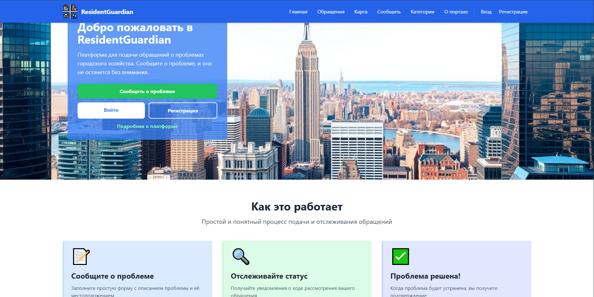

На странице обращений отображается каталог всех поданных пользователями обращений. Реализованы расширенные функции поиска, фильтрации (по времени создания, категории, статусу) и сортировки. Также используется пагинация для удобства навигации:

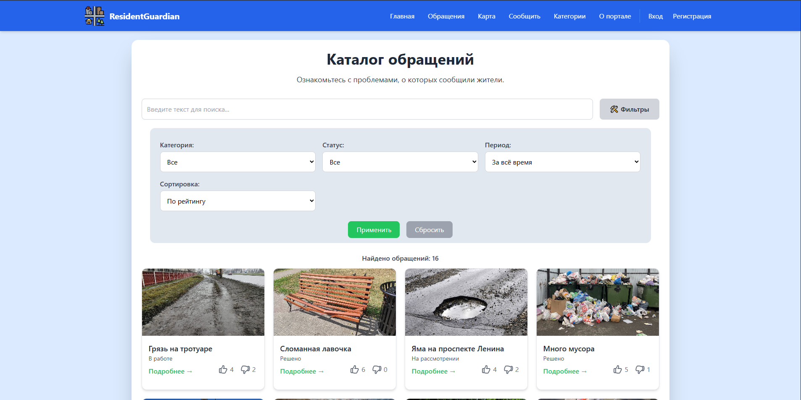

Страница карты предоставляет интерактивную карту с фильтрами для отображения всех обращений в виде точек. При наведении на точку появляется краткая информация о проблеме (мини-карточка), при нажатии — осуществляется переход на страницу подробного просмотра обращения:

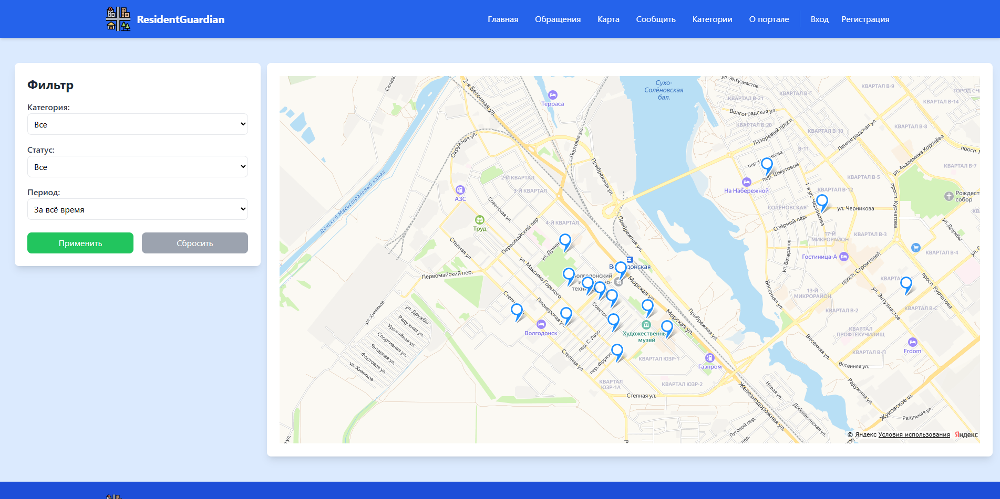

Страница создания обращения представляет собой форму с полями для ввода названия, описания проблемы, выбора категории, загрузки изображений и указания местоположения — вручную или через карту:

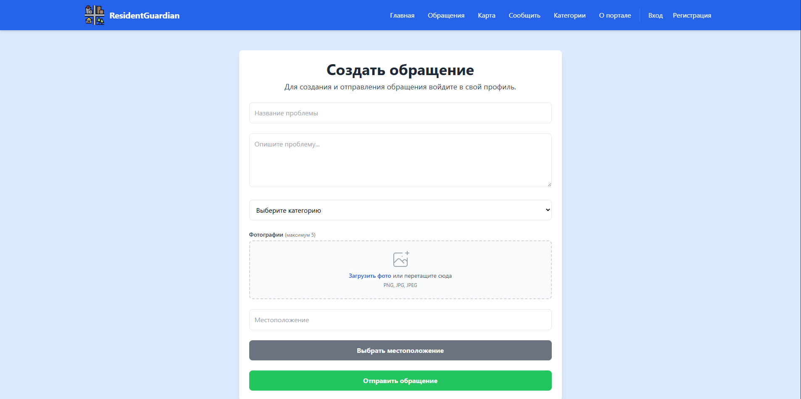

На странице подробного обращения отображается полная информация о конкретном обращении. Включает фотографии, название, описание, дату создания и редактирования, статус. Ниже представлены ответы модераторов — с текстом и изображениями. Для модераторов доступна форма добавления ответа и изменения статуса обращения. В нижней части страницы отображаются комментарии пользователей и форма отправки комментария. Страница также позволяет оценивать обращение (лайк/дизлайк) и служит центром общения и взаимодействия по конкретной проблеме:

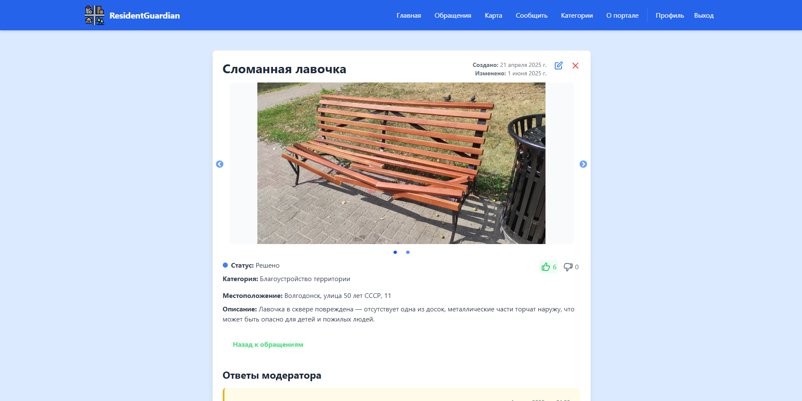

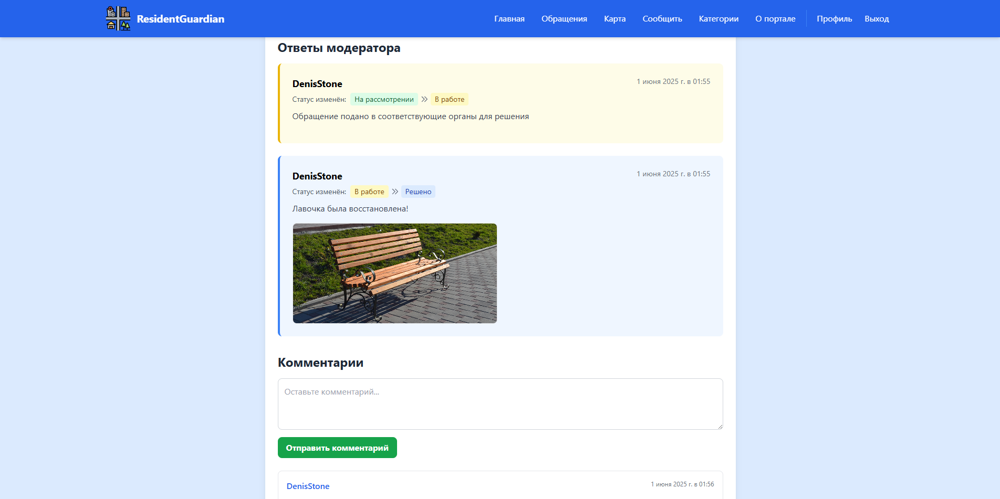

Страница с категориями содержит общую информацию о категориях:

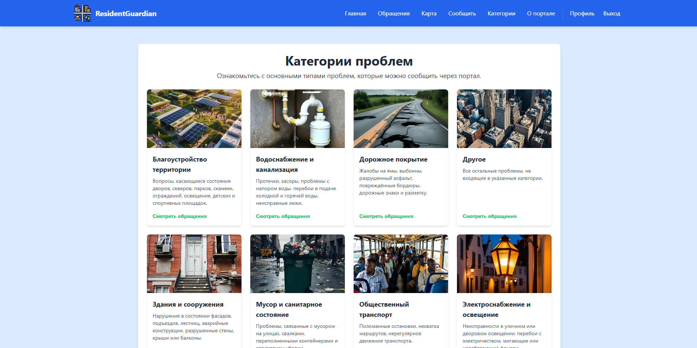

Страница «О портале» — информационная страница, содержащая описание целей и принципов работы веб-приложения:

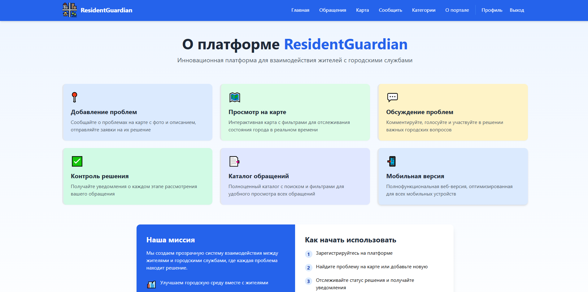

Страницы входа и регистрации предназначены для входа в систему и создания новой учётной записи. Форма входа требует email и пароль, а форма регистрации — имя, email и пароль:

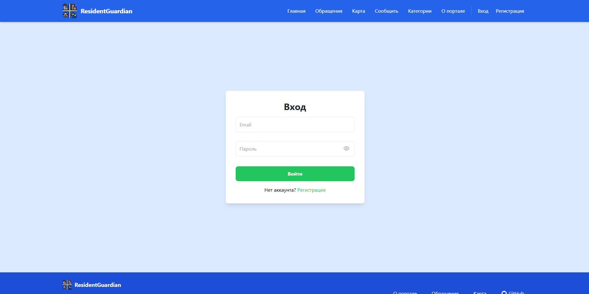

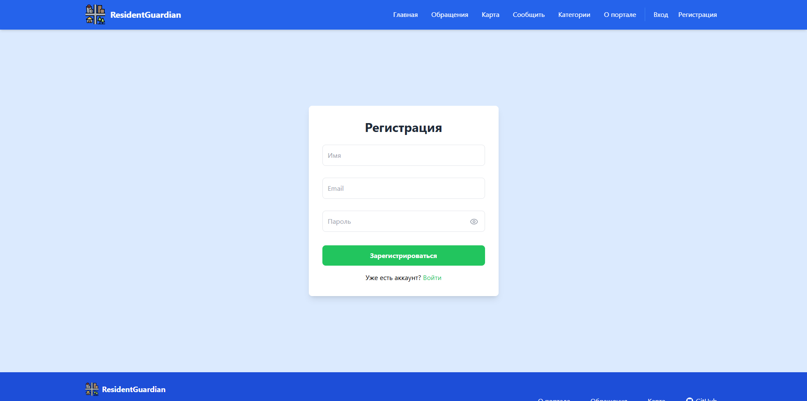

В личном кабинете пользователя содержится его данные, а также информация об обращениях, которые он отправил, и об их статусах:

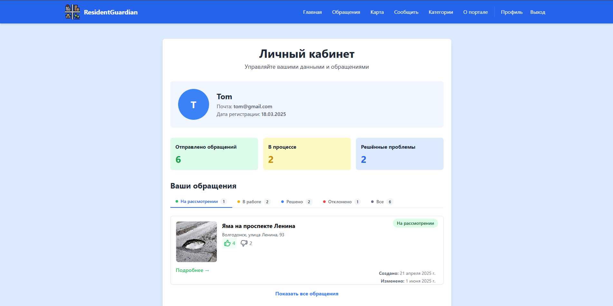

Страница модератора — специальная страница, доступная только пользователям с ролью модератора. Содержит список категорий, за которые он отвечает. Ниже представлены вкладки с обращениями, распределёнными по статусам: 

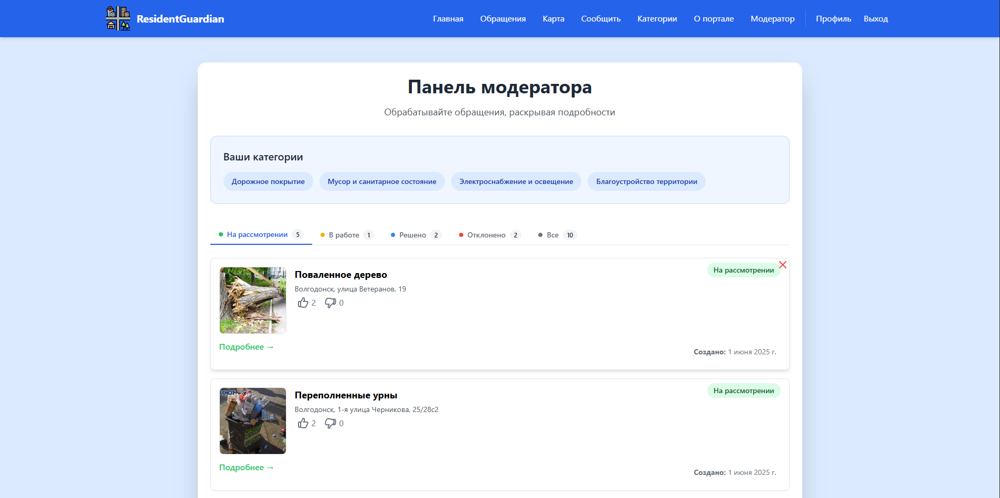

Страница администратора предназначена для пользователей с правами администратора. Содержит три вкладки: управление модераторами, управление категориями и управление удалёнными обращениями:

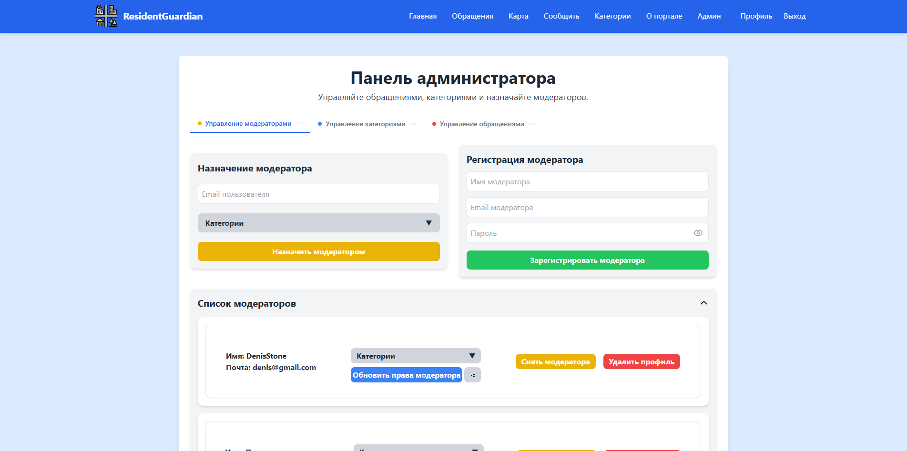

Обычные пользователи могут подавать обращения о проблемах, прикладывая описание, фотографии и указывая местоположение на карте. Также они могут просматривать обращения других пользователей, редактировать и удалять свои обращения, отслеживать их статус, оценивать обращения и оставлять комментарии.

Модераторы (представители городских служб) обрабатывают обращения в рамках закреплённых за ними категорий. Они имеют доступ к соответствующим обращениям, могут изменять их статус, оставлять текстовые ответы, прикреплять фотоотчёты, комментировать и инициировать удаление обращений.

Администраторы управляют работой системы: назначают и регистрируют модераторов, распределяют категории между ними, управляют списком категорий обращений, просматривают все обращения в системе, могут удалять их окончательно или восстанавливать, а также оставлять комментарии. Админа можно зарегистрировать только с помощью самописного инструмента CLI SeedAdminTools. 

---

## Тестовые данные

Пользователь:

> email: tom@gmail.com |
> password: 123456

Модератор:

> email: bob@gmail.com |
> password: 654321

Админ:

> email: admin@gmail.com |
> password: password

---

## Технологии
- ReactJS — для клиента
- Tailwind CSS — для стилей и адаптивности
- .NET 9 / ASP.NET Core Web API — для сервера
- ASP.NET Identity — для систему аутентификации и авторизации
- Swagger / OpenAPI — генерация Swagger UI для документации API
- Entity Framework Core — ORM для взаимодействия с базой данных
- PostgreSQL — БД для хранения данных
- Docker / Docker Compose — развертывание проекта в контейнере
- Redis — в качестве распределенного кеша
- NGINX — в качестве балансировщика нагрузки для поднятия нескольких API
- Yandex Maps API — для отображение элементов на карте, взятии координат и превращения их в адреса
- Yandex Storage — в качестве хранилища медиа (картинок).

---

## Требования
Для запуска с помощью Docker Compose понадобится только Docker Desktop для Windows/Mac или Docker Engine + Docker Compose для Unix.

Для запуска в локальной среде без Docker понадобиться npm для фронтенда, пакет .NET 9 для бекенда, PostgreSQL 16 для БД.

---

## Как запустить

### Как запустить с помощью Docker Compose
1. Рекомендуется. Используя образы с Docker Hub с балансировщиком нагрузки для поддержки нескольких API — перейдите в каталог репозитория и введите команду:

`docker compose -f .\docker-compose-init.yml up -d --scale api=<number_api>`

или с начальными тестовыми данными:

`docker compose -f .\docker-compose-full.yml up -d --scale api=<number_api>`

<number_api> — количества запускаемых API

2. Используя локальные файлы Docker — перейдите в каталог репозитория и напишите команду:

`docker-compose up`

3. Инструмент seed-admin-tool. При использовании образов с Docker Hub для запуска инструмента seed-admin-tool предназначенного для регистрации админов напишите команду:

`docker-compose -f .\docker-compose-init.yml run --rm seed-admin-tool`

или

`docker compose -f .\docker-compose-full.yml run --rm seed-admin-tool`

или при использовании локальных файлов Docker:

`docker-compose run --rm seed-admin-tool`

После запуска веб-клиент будет доступен по адресу `http://localhost:80`, по адресу `http://localhost:8080/swagger` вы можете протестировать API.

Для удаления контейнеров напишите команду:

`docker-compose down`

### Локальный запуск
- Для запуска фронтенда перейдите в каталог ./frontend/react-client и запустите для тестовой среды:

`npm start`

- Для запуска бекенда откройте Visual Studio 2022 и запустите профиль http или сделайте тоже самое с помощью CLI
- Настройте самостоятельно БД PostgreSQL (строку подключения и структуру таблиц их файла reguan_db.sql). Вместо Redis будет использоваться кеш в памяти.

---

## Конфигурация
Все переменные окружения и конфигурация определены в docker-compose

| Переменныя окружения | Описание |
| --- | --- |
| ALLOWED_ORIGINS | Разрешенные адреса для обращения к API |
| CONNECTION_STRING | Строка подключения к PostgreSQL |
| REACT_APP_API_URL | Адрес API, используемым фронтендом. Используется при билде фронтенда |
| REACT_APP_IMAGES_URL | Адрес нахождения картинок для фронтенда. Используется при билде фронтенда |

Файле reguan_db.sql — конфигурация для инициализации структуры базы данных и с начальными тестовыми данными. Позже планируется реализовать миграции.

Файле reguan_db_create_tables.sql — конфигурация для инициализации структуры базы данных. Позже планируется реализовать миграции.

Файл nginx-loadbalancer.conf — конфигурация балансировщика нагрузки.

Для Yandex Storage в appsettings.json или переменных окружения нужно установить AccessKey и SecretKey. При Local Storage используется локальное хранилище.

---

## Документация API
Подробно об отправляемых и получаемых данных посмотреть в swagger.

### Для управления обращениями:
Получение списка всех обращений с фильтрацией для отображения на карте:
> GET /api/issues

Получение списка обращений с фильтрацией, сортировкой и пагинацией:
> GET /api/issues/revored

Получения детальной информации отдельного обращения:
> GET /api/issues/{id}

Создание нового обращения:
> POST /api/issues

Изменение обращения:
> PUT /api/issues/{id}

Восстановление обращения (после мягкого удаления):
> PATCH /api/issues/restore

Мягкое удаление обращения:
> DELETE /api/issues/{id}

### Для управления категориями обращений:
Получение всех категорий:
> GET /api/categories

Создание новой категории:
> POST /api/categories

Обновление категории:
> PUT /api/categories

Удаление категории:
> DELETE /api/categories/{id}

### Для управления комментариями:
Получение всех комментариев для отдельного обращения:
> GET /api/issues/{id}/comments

Создание комментария для отдельного обращения:
> POST /api/issues/{id}/comments

Удаление комментария для отдельного обращения:
> DELETE /api/issues/{id}/comments

### Для управления оценками:
Поставить оценку для обращения:
> POST /api/issues/{id}/grades

Снять оценку для обращения:
> DELETE /api/issues/{id}/grades

### Для управлениями ответами модераторов на обращения
Получение ответов для отдельного обращения:
> GET /api/issues/{id}/answers

Создание ответа для отдельного обращения:
> POST /api/issues/{id}/answers

### Для получения информации модераторам
Получение всех категорий, по которым доступны обращения для авторизованного модератора:
> GET /api/moderation/categories

Получение всех обращений, которые доступн для ответа для авторизованного модератора:
> GET /api/moderation/issues

### Для управления админом модераторами
Получение списка всех модераторов:
> GET /api/admin/moderators

Регистрация/создание нового модератора:
> POST /api/admin/moderators

Назначение пользователю роли модератора:
> POST /api/admin/assign-moderator

Обновление/назначение категорий отдельному модератору:
> PUT /api/admin/moderator-categories

Отстранение с роли модератора:
> DELETE /api/admin/unassign-moderator/{id}

Удаление модератора:
> DELETE /api/admin/moderators/{id}

### Для аутентификации: 
Регистрация:
> POST /api/auth/register

Вход:
> POST/api/auth/login

Проверка авторизации (по токену доступа):
> GET /api/auth/check-auth

Обновление refresh токена:
> POST /api/auth/refresh-token

Выход из профиля:
> POST /api/auth/logout

### Для управления пользователями:
Получение информации об авторизованном пользователе:
> GET /api/user

Обновление информации об авторизованном пользователе:
> PUT /api/user

Получение всех обращения, который оставил авторизованный пользователь:
> GET /api/user/issues

### Для проверки состояния сервиса:
> GET /api/health

---

Продолжение следует...

